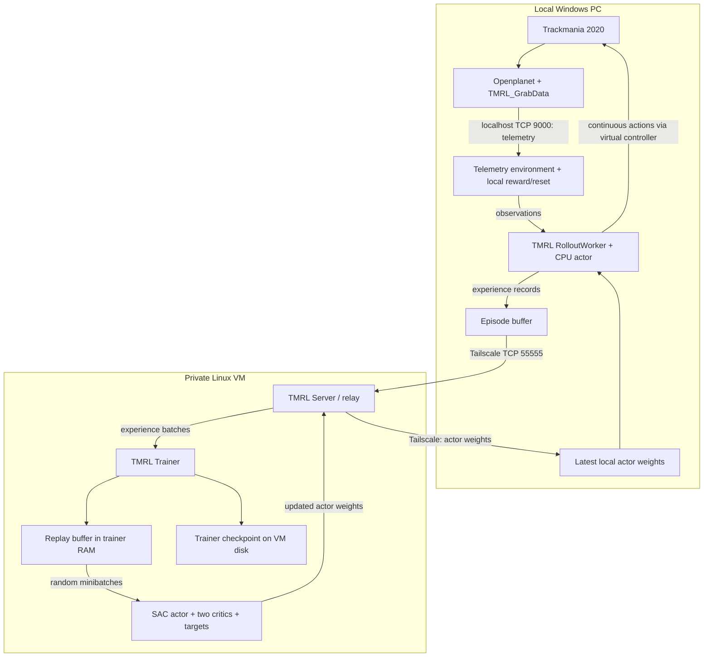

# Trackmania 2020 Telemetry SAC Implementation Plan

> Execution: implement the checkboxes in order using `superpowers:executing-plans`. This document is a plan; the project commands introduced below must be implemented before they can be run.

**Goal:** train one car to finish one Trackmania 2020 track, using local Windows policy inference and SAC training on a private Linux VM.

**Architecture:** Windows runs the game, Openplanet, the real-time environment, and one TMRL `RolloutWorker`. Linux runs the TMRL `Server` and `Trainer`, including replay memory and SAC updates. Experiences and actor weights cross Tailscale asynchronously; driving actions never require a VM response.

**Tech stack:** Python 3.12, TMRL 0.7.1, CPU PyTorch, NumPy, Gymnasium, rtgym, vgamepad on Windows, Tailscale, systemd on Linux.

**Specification:** the project brief supplied with this task. Required constraints: Trackmania 2020; Openplanet; TMRL; SAC; telemetry/road observations; one local worker; remote Linux training; initially 1 vCPU, 3 GB RAM, no GPU; private networking; unattended episodes.

## 1. Decisions and scope

### Required for V1

- One simple, flat, paved Stadium-car track, one Windows worker, one CPU trainer.
- Local continuous policy inference at 20 Hz, measured before training.
- Telemetry-only observations with a small amount of recorded route information.
- Reliable full-race restart, finish handling, stale-telemetry handling, and an emergency stop.
- TMRL's existing SAC implementation, MLP actor/critics, generic replay memory, and networking.
- Tailscale access restrictions, a unique TMRL password, and no public TMRL port.
- Versioned observation/action/reward definitions; matching code and model architecture on both machines.
- Basic episode, learning, resource, transport, and model-update logs.
- Checkpoint restart and an unattended reliability test before judging learning.

### Nice to have

- TensorBoard; official in-game lap timing exported by an additional plugin field.
- Accurate car orientation/velocity telemetry instead of finite differences.
- A small reference controller to sanity-check route features; periodic saved replays.
- A larger replay buffer after measuring memory and replay turnover.

### Future work, after reliable telemetry SAC

- Actual road-boundary distance rays from validated map geometry or a supported game API.
- Larger CPU/GPU training hardware, additional workers, richer car-state observations.
- Other observation modalities, multiple tracks, or other algorithms only as separate later projects.

### Important compatibility boundary

**TMRL's built-in LIDAR is screenshot-derived.** Its `TM2020InterfaceLidar` captures an image and runs a pixel-based rangefinder. `TMRL_GrabData` does not export road-distance rays. Consequently, selecting `TM20LIDAR` does not satisfy a strict no-screenshot requirement. [TMRL environment source](https://github.com/trackmania-rl/tmrl/blob/v0.7.1/tmrl/custom/tm/tm_gym_interfaces.py), [rangefinder source](https://github.com/trackmania-rl/tmrl/blob/v0.7.1/tmrl/custom/tm/utils/tools.py).

V1 will implement a telemetry interface with speed, motion, lateral route offset, and nearby route turns. This fits the requested telemetry/road-information starting point. It is **map-assisted driving**, with a recorded route available locally; it is not physical LIDAR and does not establish performance without map knowledge. Do not fabricate rays from telemetry or introduce screenshots to conceal this limitation.

Use a new run name and observation schema for this interface. TMRL's bundled pretrained LIDAR policy has a different input definition and cannot serve as this project's baseline. M4 means the telemetry policy executes correctly through TMRL, not that pretrained weights already drive this track.

TMRL 0.7.1 is the verified release baseline. Freeze the actual dependency versions after the smoke tests; do not follow a moving upstream branch during an experiment. [Release history](https://github.com/trackmania-rl/tmrl/releases).

The VM's feasibility is an engineering hypothesis until M6/M8 pass. No lap-time or convergence guarantee follows from its RAM/CPU specification.

## 2. Architecture and data contracts



### Responsibilities

| Component | Location | Responsibility |
|---|---|---|
| Trackmania/Openplanet | Windows | Game physics, race UI, telemetry export |
| Environment | Windows | Fresh observations, reward, controls, reset, terminal detection |
| `RolloutWorker` and actor | Windows | Sample actions locally; collect transitions; receive actor updates |
| `Server` | VM | Route experiences to trainer and actor weights to worker |
| `Trainer` | VM | Append replay records; sample batches; run SAC; publish actor |
| Replay memory | VM trainer RAM | Long-lived off-policy experience, with a fixed capacity |
| Trainer checkpoint | VM disk | Replay, actor, critics, targets, optimizer state, counters |
| Worker model file | Windows disk | Last received actor, available without a network connection |

The server's transport queues and worker's episode buffer are not the replay buffer. There is no Trackmania dedicated server, game installation, desktop, GPU, controller, or Openplanet required on the VM.

Both the worker and trainer connect to the TMRL server. The worker connects to the VM's Tailscale address; the co-located trainer connects to `127.0.0.1`. Do not make the trainer connect to the Windows telemetry plugin. [TMRL library architecture](https://github.com/trackmania-rl/tmrl/blob/v0.7.1/readme/tuto_library.md).

### Experience and policy synchronization

1. For each local step, retain observation, action, reward, next observation, termination/truncation flags, and minimal metadata.
2. Let TMRL store its native records: `(action, new_observation, reward, terminated, truncated, info)`, including its reset record. `GenericTorchMemory` reconstructs the preceding observation and excludes cross-episode transitions. Do not replace this with an incompatible transition tuple.
3. Use uncompressed telemetry records in V1: `sample_compressor=None`, `obs_preprocessor=None`. The observation is already normalized.
4. Use `RolloutWorker.run()` for asynchronous collection. Send each completed episode, capped at 60 seconds. Do not use synchronous worker/trainer stepping for the real-time game.
5. Publish actor weights every 100 SAC updates. At the initial update ratio this is approximately every 25 seconds while collecting 20 samples/second, plus episode-boundary delay.
6. Apply the newest available actor between episodes. Keep the current actor for the whole episode. Only actor weights travel to Windows; critics, optimizers, targets, and replay stay on the VM.
7. Log the actor file's SHA-256 on publish and load, plus cumulative updates/model receives. Matching file hashes are stronger evidence than a log saying an update was sent.
8. Match code revision, tensor shapes, feature order, normalizers, action mapping, and track/reward identity. Save a shared run manifest before starting; reject mismatches before collection.

These episode-boundary send/load semantics are provided by the existing worker. [TMRL networking source](https://github.com/trackmania-rl/tmrl/blob/v0.7.1/tmrl/networking.py).

## 3. Repository and implementation contracts

Create each file only in the phase that needs it; do not create empty subsystems for future work.

```text
trackmania-rl/
├── configs/
│   ├── common.json                 # Complete TMRL base + PROJECT settings
│   ├── windows.json                # Windows networking overlay
│   └── vm.json                     # VM networking overlay
├── scripts/
│   ├── bootstrap_config.py         # Stdlib config merge, secrets, validation
│   ├── smoke_local.py              # Telemetry, controls, reset, environment checks
│   ├── smoke_pipeline.py           # Synthetic experiences, SAC, weight round-trip
│   └── benchmark_trainer.py        # CPU throughput and memory measurement
├── src/
│   ├── __init__.py
│   ├── env/
│   │   ├── __init__.py
│   │   ├── telemetry.py            # Packet reader and reconnect/freshness checks
│   │   └── interface.py            # rtgym interface and episode lifecycle
│   ├── reward/
│   │   ├── __init__.py
│   │   └── route.py                # Projection, features, progress, simple reward
│   └── pipeline.py                 # Shared spaces and TMRL construction
├── tests/
│   └── self_check.py               # Small offline checks of non-trivial contracts
├── tracks/
│   └── v1/                        # Map identity, route.npz, metadata.json
├── deployment/
│   └── tmrl@.service              # Server/trainer systemd template
├── docs/superpowers/plans/
├── logs/                           # Ignored; JSONL and optional TensorBoard
├── checkpoints/                    # Ignored; VM trainer state
├── weights/                        # Ignored; local/trainer actor snapshots
├── train.py                        # --role server|trainer|worker
├── evaluate.py                     # Standalone local deterministic evaluation
├── requirements.txt                # Shared resolved dependencies
├── requirements-windows.lock.txt
├── requirements-linux.lock.txt
├── .gitignore
└── README.md
```

No custom SAC implementation or `src/agent/` is needed initially. Reuse the installed TMRL actor, critic, SAC, and replay classes. Evaluation can remain in one file until it has more than one responsibility.

### Interfaces to implement

| File | Required interface |
|---|---|
| `telemetry.py` | `TelemetryClient(host='127.0.0.1', port=9000)`; `latest(max_age_s: float) -> Telemetry`; `close()` |
| `telemetry.py` | `Telemetry`: the 11 decoded fields, receive sequence, and local monotonic receive timestamp |
| `interface.py` | `TelemetryInterface(RealTimeGymInterface)`: `send_control`, `reset`, `wait`, `get_obs_rew_terminated_info`, `get_observation_space`, `get_action_space`, `get_default_action` |
| `route.py` | `Route(path)`; `project(position, dt) -> RouteState`; `features(telemetry, route_state) -> float32[15]`; `reset()` |
| `route.py` | `ProgressReward.step(route_state, finished, dt) -> (float, terminal_reason_or_none)`; `reset()` |
| `pipeline.py` | `build_spaces() -> (observation_space, action_space)`; `build_worker(standalone=False)`; `build_training_cls()` |
| `train.py` | `--role server|trainer|worker --profile windows|vm`; run from repository root |
| `evaluate.py` | `--model PATH --episodes N --profile windows`; frozen policy, no training samples |

`TelemetryInterface.get_observation_space()` returns `Tuple(Box(shape=(15,), ...))`. rtgym appends two previous actions of shape `(3,)`; the final actor observation is a three-item tuple with **21 total floats**. The VM constructs that final tuple directly in `build_spaces()` without instantiating the Windows interface. Do not append action history twice.

Keep Windows-specific imports and controller creation inside Windows interface methods. Protect process creation with `if __name__ == '__main__':`, including smoke scripts. Use importable classes/functions for trainer checkpoints; do not checkpoint a TensorBoard writer or an open socket.

Scripts launched by filesystem path must add `Path(__file__).resolve().parents[1]` to `sys.path` before importing `src`; Python otherwise starts their import path in `scripts/`. Resolve project data paths from that repository root. No editable package installation is needed for V1.

### TMRL argument bindings

In `src/pipeline.py`, map the effective configuration to constructor arguments explicitly:

- Actor: `partial(SquashedGaussianMLPActor, hidden_sizes=(64, 64))`.
- SAC model: `partial(MLPActorCritic, hidden_sizes=(64, 64))`.
- Memory: `partial(GenericTorchMemory, memory_size=50000, batch_size=64)`.
- Worker environment factory: `partial(GenericGymEnv, id='real-time-gym-v1', gym_kwargs={'config': custom_rtgym_config})` on Windows only.
- Worker: `RolloutWorker(env_cls=worker_env_cls, actor_module_cls=actor_cls, sample_compressor=None, obs_preprocessor=None, device='cpu', max_samples_per_episode=1200, ...)`; use the Windows destination and local port 55558.
- Training: `partial(ProjectTrainingOffline, env_cls=build_spaces(), memory_cls=memory_cls, training_agent_cls=agent_cls, device='cpu', ...)`; map the schedule values in Section 4 to their snake-case constructor arguments.
- Trainer: `Trainer(training_cls=training_cls, server_ip='127.0.0.1', server_port=55555, local_com_port=55557, ...)` on the VM.
- Server: `Server(port=55555, local_port=55556, max_workers=1, ...)` on the VM.

`ProjectTrainingOffline` is a small subclass in `src/pipeline.py`: override `run_epoch(interface)` to publish `self.agent.get_actor()` before calling the parent method, then report/save its returned statistics. Publishing at the start of each epoch also gives newly connected workers an initial actor before warmup and after checkpoint resume. Leave the parent SAC scheduling and replay code intact.

Pass the password, security, transport buffer size where supported, and explicit paths rather than relying on constructor defaults. Paths are `weights/<RUN_NAME>.tmod` for the worker, `weights/<RUN_NAME>_t.tmod` for the trainer actor, and `checkpoints/<RUN_NAME>_t.tcpt` for trainer state. Create their parent directories before constructing the objects.

## 4. Configuration ownership

TMRL reads `~/TmrlData/config/config.json` at import time. Therefore, prepare configuration before importing TMRL and restart all affected processes after changing it. Preserve the downloaded config's required fields and `__VERSION__`; an overlay is not a replacement config. [Configuration constants](https://github.com/trackmania-rl/tmrl/blob/v0.7.1/tmrl/config/config_constants.py).

`bootstrap_config.py` must:

- [ ] Copy the installed default configuration into `configs/common.json`, replace the bundled W&B credential with `"WANDB_KEY": ""` while retaining the required key, and apply the values below.
- [ ] Deep-merge the chosen machine overlay into the common file; validate JSON, port uniqueness, positive buffer sizes, and CPU settings.
- [ ] Read the password from `TMRL_PASSWORD`; never put the real password in committed configs or print it.
- [ ] Write the effective `~/TmrlData/config/config.json` atomically. Save a redacted copy in `logs/<run>/`.
- [ ] Save/compare a shared manifest containing code revision, dependency versions, schema `telemetry-route-v1`, feature order, hidden sizes, action mapping, control period, and route/reward hashes. Machine IPs and local filesystem paths are excluded from the shared fingerprint.

### Common values: merge into the complete default config

```json
{
  "RUN_NAME": "telemetry_route_sac_v1_seed0",
  "CUDA_TRAINING": false,
  "CUDA_INFERENCE": false,
  "VIRTUAL_GAMEPAD": true,
  "TLS": false,
  "NB_WORKERS": 1,
  "PORT": 55555,
  "LOCAL_PORT_SERVER": 55556,
  "LOCAL_PORT_TRAINER": 55557,
  "LOCAL_PORT_WORKER": 55558,
  "HEADER_SIZE": 12,
  "BUFFER_SIZE": 4194304,
  "BUFFERS_MAXLEN": 5000,
  "RW_MAX_SAMPLES_PER_EPISODE": 1200,
  "MEMORY_SIZE": 50000,
  "BATCH_SIZE": 64,
  "ENVIRONMENT_STEPS_BEFORE_TRAINING": 2000,
  "MAX_TRAINING_STEPS_PER_ENVIRONMENT_STEP": 0.2,
  "UPDATE_MODEL_INTERVAL": 100,
  "UPDATE_BUFFER_INTERVAL": 1,
  "TRAINING_STEPS_PER_ROUND": 100,
  "ROUNDS_PER_EPOCH": 10,
  "MAX_EPOCHS": 10000,
  "SAVE_MODEL_EVERY": 0,
  "ALG": {
    "ALGORITHM": "SAC",
    "LR_ACTOR": 0.0003,
    "LR_CRITIC": 0.0003,
    "LR_ENTROPY": 0.0003,
    "GAMMA": 0.99,
    "POLYAK": 0.995,
    "LEARN_ENTROPY_COEF": true,
    "TARGET_ENTROPY": -3.0,
    "ALPHA": 0.1,
    "OPTIMIZER_ACTOR": "adam",
    "OPTIMIZER_CRITIC": "adam"
  },
  "PROJECT": {
    "observation_schema": "telemetry-route-v1",
    "hidden_sizes": [64, 64],
    "seed": 0,
    "route_path": "tracks/v1/route.npz",
    "telemetry_max_age_s": 0.25,
    "reset_timeout_s": 10,
    "reset_attempts": 3,
    "stuck_grace_s": 5,
    "stuck_window_s": 3,
    "stuck_min_progress_m": 1,
    "policy_stale_pause_s": 180,
    "initial_policy_grace_s": 300
  }
}
```

`PROJECT` is an explicitly **new project setting**, read by `src/pipeline.py` and the custom environment. Upstream TMRL will not interpret it. Bind `hidden_sizes=(64,64)` to **both** `SquashedGaussianMLPActor` and `MLPActorCritic` using `tmrl.util.partial`. JSON alone does not resize TMRL's default networks. [MLP constructors](https://github.com/trackmania-rl/tmrl/blob/v0.7.1/tmrl/custom/custom_models.py).

Apply this custom rtgym configuration in the Windows environment factory:

```python
config = rtgym.DEFAULT_CONFIG_DICT.copy()
config.update(
    interface=TelemetryInterface,
    time_step_duration=0.05,
    start_obs_capture=0.05,
    time_step_timeout_factor=1.0,
    act_in_obs=True,
    act_buf_len=2,
    reset_act_buf=True,
    wait_on_done=True,
    ep_max_length=1200,
    last_act_on_reset=False,
)
```

Use `real-time-gym-v1` on Windows, as the pinned TMRL pipeline does. The custom interface reads fresh buffered telemetry; it does not capture images. [rtgym interface/configuration](https://github.com/yannbouteiller/rtgym).

### Machine overlays

| Key | Windows production | VM production | All-local M4 test |
|---|---|---|---|
| `LOCALHOST_WORKER` | `false` | `false` | `true` |
| `LOCALHOST_TRAINER` | `false` | `true` | `true` |
| `PUBLIC_IP_SERVER` | VM Tailscale IPv4 | VM Tailscale IPv4 | `127.0.0.1` |

Despite its name, `PUBLIC_IP_SERVER` should contain the **private Tailscale IP** here. It determines client destinations; it is not a server bind-address setting. The normal server can listen on all interfaces, so firewall and tailnet policy enforcement are required.

Project entrypoints use the configured network fields explicitly when constructing TMRL objects. Do not pretend that adding `ENV.RTGYM_INTERFACE="TELEMETRY"` selects a new class in the stock CLI. Leave legacy environment config fields valid for imports, but use `build_worker()` and `build_training_cls()` for this project.

`BUFFER_SIZE` controls transport reads, not a total memory budget. `BUFFERS_MAXLEN` caps TMRL sample buffers, not every tlspyo queue. Do not assume these two settings bound relay backlog. [TMRL config reference](https://github.com/trackmania-rl/tmrl/blob/v0.7.1/readme/reference_guide.md), [tlspyo API](https://github.com/MISTLab/tls-python-object/blob/master/tlspyo/api.py).

## 5. Ordered implementation phases

Commands containing `<VM_TS_IP>`, `<PC_TS_IP>`, `<VM_ADMIN>`, or `<REPO_URL>` require substitution with the measured Tailscale addresses, the existing VM administrator login, and this project's Git remote. Commands beginning `python scripts/...`, `train.py`, or `evaluate.py` describe project interfaces to implement; they are not bundled TMRL commands.

### Phase A — Game integration and Python installation

**Goal:** confirm Openplanet works and install the supported integration without starting RL.

**Files/configuration:** `requirements.txt`, `.gitignore`, installed `~/TmrlData/`, `~/OpenplanetNext/Plugins/`.

**Exact tasks**

- [ ] Start Trackmania and load a playable local practice track. Press F3; confirm the Openplanet menu and log are available. Resolve Openplanet/game-version or Visual C++ runtime failures first.
- [ ] Use 64-bit Python 3.12 on Windows. The current local machine already lists Python 3.12; verify it with `py -3.12 --version`. If missing, install it from Python's official Windows installer before continuing.
- [ ] Create the venv in the repository. Calling its interpreter directly avoids changing machine-wide PowerShell execution policy.

```powershell
py -3.12 -m venv .venv
.\.venv\Scripts\python.exe -m pip install --upgrade pip
.\.venv\Scripts\python.exe -m pip install torch --index-url https://download.pytorch.org/whl/cpu
.\.venv\Scripts\python.exe -m pip install tmrl==0.7.1
.\.venv\Scripts\python.exe -m pip check
.\.venv\Scripts\python.exe -m tmrl --install
```

Install CPU PyTorch first so installing TMRL does not select a Linux CUDA wheel later. Freeze the resolved `torch` version and use the same version on Linux. GPU inference is unnecessary for this MLP. [Official PyTorch installation](https://pytorch.org/get-started/locally/).

- [ ] Accept the vgamepad driver installer if needed; reboot if requested. Verify the virtual Xbox controller through Windows `joy.cpl` before trying game control. [vgamepad installation](https://github.com/yannbouteiller/vgamepad).
- [ ] Verify `TMRL_GrabData.op` exists in `%USERPROFILE%\OpenplanetNext\Plugins`. Copy it from `%USERPROFILE%\TmrlData\resources\Plugins` if the automatic installation missed it.

```powershell
Test-Path "$env:USERPROFILE\OpenplanetNext\Plugins\TMRL_GrabData.op"
# Only if it is missing:
Copy-Item "$env:USERPROFILE\TmrlData\resources\Plugins\TMRL_GrabData.op" "$env:USERPROFILE\OpenplanetNext\Plugins\"
```

- [ ] Reload the plugin through Openplanet's developer/plugin reload menu and inspect its log for socket creation/listening and absence of script errors. The exact menu label can vary with Openplanet version.
- [ ] Keep one plugin copy and one telemetry client; the bundled plugin serves one active connection at a time.
- [ ] Record game, Openplanet, plugin, Python, TMRL, and PyTorch versions. Ignore `.venv/`, generated effective config, logs, weights, checkpoints, and secrets in Git.

The documented TMRL install creates `TmrlData` and supplies the plugin. Its resources include the plugin source inside the `.op` archive. [TMRL installation instructions](https://github.com/trackmania-rl/tmrl/blob/v0.7.1/readme/Install.md), [maintainer guidance on plugin source](https://github.com/trackmania-rl/tmrl/discussions/137).

**Expected output:** `pip check` reports no broken requirements; `--install` prints the TMRL data folder; plugin appears loaded and listens on localhost.

**Verification:** F3 works in a loaded track, the plugin log is clean, and `Get-NetTCPConnection -LocalPort 9000 -State Listen` shows a listener on `127.0.0.1`.

**Common failures:** Python architecture mismatch, missing runtime/driver, plugin copied into `Scripts` instead of `Plugins`, resource download failure, old `TmrlData` config retained from a prior install, duplicate port listener.

**Completion criteria:** M0 passed; Python environment imports TMRL. No training has started.

### Phase B — Telemetry

**Goal:** prove that Python receives correct, fresh game state continuously.

**Files/configuration:** create `src/env/telemetry.py`, telemetry mode in `scripts/smoke_local.py`, `tests/self_check.py`.

**Exact tasks**

- [ ] Decode the bundled plugin's **44-byte, little-endian, 11-float** packet using `struct.Struct('<11f')`.
- [ ] Confirm this mapping against the installed plugin source, not a guessed telemetry schema:

| Index | Field |
|---|---|
| 0 | `api.Speed` |
| 1 | `api.Distance` — traveled distance, not route completion |
| 2–4 | `api.Position.x/y/z` |
| 5 | `api.InputSteer` |
| 6 | `api.InputGasPedal` |
| 7 | `api.InputIsBraking`, encoded 0/1 |
| 8 | Finish UI sequence flag, encoded 0/1 |
| 9 | `api.EngineCurGear` |
| 10 | `api.EngineRpm` |

This mapping comes from the `TMRL_GrabData.op` source shipped in the official [resource archive](https://github.com/trackmania-rl/tmrl/releases/download/v0.6.0/resources.zip). These packets contain no yaw, road rays, race timer, collision flag, or official checkpoint count.

- [ ] Use one background socket reader, a small latest-packet buffer, a lock, local receive sequence, and monotonic timestamp. Read complete packets even when TCP fragments or coalesces them. Discard older complete packets when only the latest state is needed.
- [ ] Reject nonfinite fields. On `recv()==b''`, close and reconnect with bounded delay; never loop on EOF. Reset packet accumulation on every reconnect.
- [ ] Require packet age under 250 ms for control. A missing stream must trigger neutral controls and episode abort rather than driving from stale state.
- [ ] Use TMRL's client for the first quick probe if desired; production uses this small reader because the upstream reader explicitly lacks disconnect handling. [Upstream telemetry client](https://github.com/trackmania-rl/tmrl/blob/v0.7.1/tmrl/custom/tm/utils/tools.py).

```powershell
.\.venv\Scripts\python.exe scripts\smoke_local.py telemetry --seconds 120
```

- [ ] Manually accelerate, steer, brake, restart, and finish while the probe logs rates and fields. Calibrate `api.Speed` units against position-derived speed during steady driving; store the measured conversion in track metadata. Do not infer units from the HUD alone.
- [ ] Store a short telemetry fixture. Offline checks must decode a known packet, split it across reads, concatenate packets, simulate EOF, and reject NaNs.

**Expected output:** advancing receive sequence, changing position/speed, correlated input fields, finish flag toggling, receive rate at least 20 Hz under normal gameplay.

**Verification:** reload the plugin during the probe and recover without an infinite loop; stop the stream and detect staleness within 250 ms. Confirm speed and position values are plausible.

**Common failures:** no playable car loaded, plugin script failure after a game update, second client consuming the stream, wrong endian/field count, game paused, missing fresh packets, confusing traveled distance with progress.

**Completion criteria:** M1 passed; two minutes of valid telemetry and a successful disconnect/reconnect test.

### Phase C — Controls

**Goal:** Python controls throttle, brake, and steering, with safe neutralization.

**Files/configuration:** control mode in `scripts/smoke_local.py`; control methods in `src/env/interface.py`; action convention in `configs/common.json`.

**Exact tasks**

- [ ] Reuse `vgamepad.VX360Gamepad` and TMRL's `control_gamepad`. Do not write a controller driver.
- [ ] Keep TMRL's policy action order **`[gas, brake, steer]`**, each in `[-1,1]`.
- [ ] Map gas to `max(0, action[0])`, brake to `max(0, action[1])`, and steering to `action[2]`. This matches the bundled continuous controller implementation. Negative pedal values mean released pedals, not reverse throttle. [Control mapping](https://github.com/trackmania-rl/tmrl/blob/v0.7.1/tmrl/custom/tm/utils/control_gamepad.py).
- [ ] Reject NaN/Inf and wrong-shaped actions; clamp only small numeric range overshoots. Use neutral `[0,0,0]` on shutdown, errors, and telemetry staleness.
- [ ] Hold modest throttle for one second, release it, then test modest steering in each direction and braking at low speed. Keep the game foreground and remove other active controller input during the test.

```powershell
.\.venv\Scripts\python.exe scripts\smoke_local.py controls
```

- [ ] Implement Ctrl+C/finally neutralization and a local stop-file emergency mechanism checked during collection. The freshness watchdog must release controls if the environment stops making progress.
- [ ] Verify applied inputs in fields 5–7, allowing for game sampling delay and braking's Boolean telemetry.

**Expected output:** matching steer/gas/brake telemetry and visible low-speed car motion; controls release after every test.

**Verification:** both steering directions work; braking reduces speed; Ctrl+C releases pedals. Do not use the keyboard fallback as proof of continuous control.

**Common failures:** missing virtual-controller driver, game bound to a different controller, game not focused, overlays intercepting input, swapped gas/steer order, opposing inputs from another device.

**Completion criteria:** M2 passed; each action dimension and emergency neutralization verified.

### Phase D — Full-race reset and episode lifecycle

**Goal:** repeatedly restart from the same start state without human input.

**Files/configuration:** lifecycle in `src/env/interface.py`, reset mode in `scripts/smoke_local.py`; reset delays and spawn reference in config/track metadata.

**Exact tasks**

- [ ] Reuse TMRL's gamepad reset and finish-popup helpers, but verify the actual binding. Its helper presses B; on the installed game setup this must produce a **full restart**, not a respawn at the last official checkpoint.
- [ ] If necessary, bind the game's full restart/give-up action explicitly or use the existing keyboard Delete restart helper. Record the verified binding; never alternate reset mechanisms without state verification.
- [ ] Store spawn position and a calibrated countdown wait. Start with two seconds, then measure and adjust. Near-start position alone does not prove the countdown ended.
- [ ] Implement `neutralize -> dismiss finish UI if present -> full restart -> fresh telemetry -> spawn/countdown checks -> reset histories -> run`.
- [ ] Accept a reset only with a new packet after the reset command, finish flag cleared, position within 2 game metres of the spawn reference, speed below 0.5 m/s, and the calibrated countdown delay complete. Require three fresh consistent packets.
- [ ] Wait at most 10 seconds per attempt; retry at most three times. On failure, stop collection, leave controls neutral, and log the reason. A supervisor may restart the worker, but must not keep sending throttle into menus.
- [ ] On successful reset, clear route index, maximum progress, finish-bonus latch, timers, finite-difference history, and action history. Never store a transition connecting the previous episode to the new spawn.

```powershell
.\.venv\Scripts\python.exe scripts\smoke_local.py reset --cycles 100
```

**Expected output:** 100 successful returns to the same spawn state, with reset latency and retry counters.

**Verification:** test from a crash, a finished run, after crossing an official checkpoint, and after opening/closing a menu. Checkpoint-respawn is a failed test even if the car can move again.

**Common failures:** B/Backspace respawns instead of restarting, finish popup consumes input, countdown delay too short, stale finish flag, game minimized/paused, replay-save UI blocking restart.

**Completion criteria:** M3 passed; 100/100 resets succeed without manual intervention. Disable replay saving for V1.

### Phase E — Local TMRL verification

**Goal:** verify the custom telemetry environment and TMRL flow on Windows before networking or learning.

**Files/configuration:** `src/pipeline.py`, `train.py`, `scripts/bootstrap_config.py`, local and pipeline smoke modes; all-local overlay values.

**Exact tasks**

- [ ] Isolate every pre-learning smoke test under `RUN_NAME=pipeline_smoke` and a manifest route identity `smoke-no-route`. Smoke modes bypass loading a real route and use the fixed dummy features. Do not mix smoke records, actors, or checkpoints into the production run.
- [ ] Implement `TelemetryInterface` directly against rtgym. Do not inherit screenshot capture paths from the stock TM interface.
- [ ] Temporarily return zero road features and zero reward in a clearly named smoke mode. Keep the final 15+6 observation shape; do not call this a learning environment. Limit each smoke episode to a few seconds.
- [ ] Build a standalone TMRL worker using `SquashedGaussianMLPActor(hidden_sizes=(64,64))` on CPU. Start with neutral/scripted controls before exercising its random initialized actor.
- [ ] Run ten short episodes and verify shape, dtype, finite values, flags, default action, and reset behavior. No bundled pretrained model is loaded.
- [ ] Measure local inference latency, whole-step timing, and fresh packet rate at 20 Hz. Aim for inference p95 below 5 ms and at least 95% of steps within 60 ms. Investigate recurring rtgym overruns before learning.
- [ ] Implement a synthetic environment with the same final spaces and a deterministic test fixture, for transport/trainer tests without a game.
- [ ] Start a local TMRL server, a synthetic worker, and a trainer in separate processes. Verify record transfer and one CPU SAC update; then stop this temporary run.

```powershell
.\.venv\Scripts\python.exe scripts\smoke_local.py environment --episodes 10
.\.venv\Scripts\python.exe scripts\smoke_pipeline.py local --updates 1
.\.venv\Scripts\python.exe tests\self_check.py
.\.venv\Scripts\python.exe -m pip freeze > requirements-windows.lock.txt
```

**Expected output:** valid 21-float actor inputs; valid bounded actions; correct episode resets; one finite synthetic SAC update; transport receive count increases.

**Verification:** sampled replay transitions never cross episode boundaries; actor architecture matches trainer actor; `build_spaces()` matches the live environment exactly.

**Common failures:** action history appended twice, tuple/flat observation mismatch, invalid default action, loading pretrained weights with a different architecture, Windows multiprocessing without a main guard.

**Completion criteria:** M4 passed. This is pipeline validation, not an attempt to learn the actual track.

### Phase F — Private networking

**Goal:** Windows reaches a private VM TMRL endpoint with no public RL service exposure.

**Files/configuration:** `configs/windows.json`, `configs/vm.json`, Tailscale policy, host/cloud firewall rules.

**Exact tasks**

- [ ] Choose an x86-64 **Ubuntu Server 24.04 LTS minimal** VM with approximately 1 vCPU and 3 GB RAM. This provides a straightforward Python 3.12 baseline. Do not install a desktop or container stack.
- [ ] Install Tailscale on both machines; sign them into the same controlled tailnet. Verify both devices are approved and authorized.

Linux, as an administrator:

```bash
curl -fsSL https://tailscale.com/install.sh -o /tmp/tailscale-install.sh
# Inspect the downloaded installer, then:
sudo sh /tmp/tailscale-install.sh
sudo tailscale up
tailscale status
tailscale ip -4
```

Use the official Windows installer, sign in, and run `tailscale status`, `tailscale ip -4`, and `tailscale ping <VM_TS_IP>` in PowerShell. [Linux installation](https://tailscale.com/docs/install/linux), [Windows installation](https://tailscale.com/docs/install/windows).

- [ ] Add least-privilege tailnet grants for the Windows device to VM TCP 55555 and for the administrator device to VM TCP 22. For a two-machine prototype, exact stable Tailscale IPv4s are sufficient; tags can be added later.

Example policy fragment, merged with the existing tailnet policy:

```json
{
  "grants": [
    {"src": ["<PC_TS_IP>"], "dst": ["<VM_TS_IP>"], "ip": ["tcp:55555", "tcp:22"]}
  ]
}
```

Remove or narrow an existing allow-all rule if it would defeat this restriction; grants are additive. Confirm access tests in the Tailscale policy editor. [Grants syntax](https://tailscale.com/docs/reference/syntax/grants).

- [ ] Generate a unique shared password with Python `secrets.token_urlsafe(32)`; transfer it securely. Use `TMRL_PASSWORD` only during config generation and protect the resulting config with filesystem permissions.
- [ ] Keep TMRL `TLS=false` only within the encrypted, restricted tailnet and localhost. If public transport is ever introduced, require TMRL TLS with certificate/hostname validation as well. A password by itself does not encrypt TCP. [TMRL security guidance](https://github.com/trackmania-rl/tmrl#security).
- [ ] Treat the authorized worker and trainer as trusted endpoints: tlspyo transfers pickled Python objects. Tailnet membership alone must not authorize arbitrary devices to submit objects; use the narrow device grants and shared secret. [Serialization defaults](https://github.com/MISTLab/tls-python-object/blob/master/tlspyo/api.py).
- [ ] Deny inbound TCP 55555 and all internal TMRL ports in the cloud public firewall/security group, including IPv6. Do not create router port forwarding or Tailscale Funnel.

Host firewall example; retain console access and existing management access until private SSH is verified:

```bash
sudo ufw default deny incoming
sudo ufw default allow outgoing
sudo ufw allow in on tailscale0 from <PC_TS_IP> to any port 55555 proto tcp
sudo ufw allow in on tailscale0 from <PC_TS_IP> to any port 22 proto tcp
sudo ufw enable
sudo ufw status verbose
```

Tailscale installs netfilter rules that may bypass UFW for tailnet traffic. Treat tailnet grants as the primary restriction among tailnet peers, and verify effective reachability instead of trusting UFW output alone. [Tailscale firewall caveat](https://tailscale.com/docs/use-cases/personal-or-at-home-use/share-private-game-server).

**Ports/services**

| Port | Machine | Exposure |
|---|---|---|
| TCP 9000 | Windows plugin | `127.0.0.1` only; never remote |
| TCP 55555 | VM server | Tailnet Windows worker and localhost trainer |
| TCP 55556 | VM server IPC | Localhost only |
| TCP 55557 | VM trainer IPC | Localhost only |
| TCP 55558 | Windows worker IPC | Localhost only |
| TCP 22 | VM SSH | Approved private management devices |
| TCP 6006 | Optional TensorBoard | Localhost, reached through SSH tunnel |

Tailscale needs its own outbound connectivity; blocked UDP may cause encrypted relay use. Direct peer connectivity is desirable but not necessary for correct local steering. Do not open public 55555 to resolve a Tailscale transport problem. [Tailscale firewall ports](https://tailscale.com/docs/reference/faq/firewall-ports).

- [ ] Before TMRL is installed remotely, temporarily run a tiny TCP echo listener on VM port 55555, bound to the Tailscale IP. Send `ping`, expect `pong`, and stop the listener. Implement this as a mode of `smoke_pipeline.py` using standard-library sockets.
- [ ] Parse echo modes before importing TMRL or project numeric modules so this standalone probe requires only Python. Copy that one script to the VM; the complete repository checkout and Python ML environment follow in Phase G.

```powershell
scp scripts\smoke_pipeline.py <VM_ADMIN>@<VM_TS_IP>:/tmp/smoke_pipeline.py
```

```bash
# VM test listener; install Python if absent from the minimal image:
sudo apt update
sudo apt install -y python3.12
python3.12 /tmp/smoke_pipeline.py echo-server --bind <VM_TS_IP> --port 55555
```

```powershell
py -3.12 scripts\smoke_pipeline.py echo-client --server <VM_TS_IP> --port 55555
```

- [ ] Verify the port is unreachable via the VM's public IP and from an unauthorized tailnet device. On Windows, use `Test-NetConnection <VM_TS_IP> -Port 55555` while the test listener is active.
- [ ] Verify ordinary SSH over Tailscale before closing any temporary public management access.

**Expected output:** Tailscale peers reachable; echo returns `pong`; public endpoint and unauthorized peers fail to connect.

**Verification:** test the actual TCP application port, not just ICMP. Record whether Tailscale is direct or relayed.

**Common failures:** wrong IP, devices in different tailnets, expired device authorization, broad/missing grant, host firewall, listener not running, public IPv6 still permitted, port in use.

**Completion criteria:** M5 passed; two-way TCP exchange through the tailnet and proven public-port denial.

### Phase G — Remote CPU trainer

**Goal:** install the VM runtime and prove SAC updates on CPU before using real track experiences.

**Files/configuration:** Linux lockfile, `src/pipeline.py`, `benchmark_trainer.py`, `configs/vm.json`, `deployment/tmrl@.service`.

**Exact tasks**

- [ ] Create a non-root runtime user named `tmrl`; use `/home/tmrl/trackmania-rl` as its checkout. Install OS packages from the administrator account, then enter the runtime user's shell for repository/Python setup. Arrange ordinary authorized SSH access for this user if needed; it does not need sudo privileges to train.

```bash
sudo apt update
sudo apt install -y python3.12 python3.12-venv python3-pip git ca-certificates \
  libgl1 libglib2.0-0 sysstat
sudo adduser --disabled-password --gecos '' tmrl
sudo -iu tmrl
git clone <REPO_URL> /home/tmrl/trackmania-rl
cd /home/tmrl/trackmania-rl
python3.12 -m venv .venv
source .venv/bin/activate
python -m pip install --upgrade pip
python -m pip install 'torch==<WINDOWS_RESOLVED_TORCH_VERSION>' --index-url https://download.pytorch.org/whl/cpu
python -m pip install tmrl==0.7.1
python -m pip check
python -m tmrl --install
python -c "import torch; print(torch.__version__, torch.version.cuda, torch.cuda.is_available())"
python -c "from tmrl.networking import Server, Trainer; print('headless imports OK')"
```

Use the public release version from the Windows lockfile, including its CPU build where applicable. Do not copy Windows-only package pins such as `pywin32` into the Linux lockfile. Match shared packages, particularly torch, numpy, gymnasium, rtgym, and tlspyo. The shared `requirements.txt` records the verified common pins; platform lockfiles record full installations.

- [ ] Expected CUDA output: `torch.version.cuda` is `None`, and CUDA availability is `False`. Also assert both training agent and batch device are CPU.
- [ ] TMRL imports some game-support packages even on the trainer. If an import complains about `libGL`, resolve the named library; if it tries to create a game/window, correct the trainer wiring. Do not install Trackmania, configure a virtual controller, or use a live environment on the VM.
- [ ] Construct `TorchTrainingOffline` with `env_cls=(observation_space, action_space)` and `device='cpu'`. Construct `GenericTorchMemory(memory_size=50000, batch_size=64)` and `SpinupSacAgent` with the common settings. [Headless spaces-tuple tutorial](https://github.com/trackmania-rl/tmrl/blob/v0.7.1/tmrl/tuto/tuto_minimal_pendulum.py).
- [ ] Set thread limits before numeric work, once per process:

```bash
export OMP_NUM_THREADS=1
export MKL_NUM_THREADS=1
export OPENBLAS_NUM_THREADS=1
export NUMEXPR_NUM_THREADS=1
```

```python
torch.set_num_threads(1)
torch.set_num_interop_threads(1)
```

- [ ] Benchmark 1,000 complete SAC updates on synthetic batches with the exact final spaces, networks, entropy tuning, and optimizer settings. Include replay sampling in a second measurement; do not benchmark only an actor forward pass.

```bash
python scripts/benchmark_trainer.py --updates 1000 --replay-size 50000
python -m pip freeze > requirements-linux.lock.txt
```

- [ ] Verify finite losses and changed actor parameters; targets and optimizer state must exist. Save/reload the trainer checkpoint and perform another update.
- [ ] Generate private VM effective config. `chmod 600 ~/TmrlData/config/config.json`. Point all project model/checkpoint paths explicitly at repository `weights/` and `checkpoints/`; avoid accidentally resuming a bundled/default run.
- [ ] Add the systemd template below. `train.py` must keep the server process alive after constructing `Server`; that constructor already starts networking.

```ini
# /etc/systemd/system/tmrl@.service
[Unit]
Description=Trackmania RL %i
Wants=network-online.target tailscaled.service
After=network-online.target tailscaled.service

[Service]
Type=simple
User=tmrl
WorkingDirectory=/home/tmrl/trackmania-rl
Environment=PYTHONUNBUFFERED=1
Environment=OMP_NUM_THREADS=1
Environment=MKL_NUM_THREADS=1
Environment=OPENBLAS_NUM_THREADS=1
Environment=NUMEXPR_NUM_THREADS=1
ExecStart=/home/tmrl/trackmania-rl/.venv/bin/python train.py --role %i --profile vm
Restart=on-failure
RestartSec=10
TimeoutStopSec=30
UMask=0077

[Install]
WantedBy=multi-user.target
```

```bash
# Return to the administrator shell to install/manage the service:
sudo cp /home/tmrl/trackmania-rl/deployment/tmrl@.service /etc/systemd/system/
sudo systemctl daemon-reload
sudo systemctl enable --now tmrl@server
sudo systemctl enable --now tmrl@trainer
sudo systemctl status tmrl@server tmrl@trainer
journalctl -u tmrl@trainer -f
ss -lntp
```

The trainer may start before the relay is ready; use the underlying client's reconnect behavior and verify this startup order in Phase H. Do not launch both a foreground trainer and the trainer service.

**Expected output:** CPU-only torch, successful headless imports, finite synthetic losses, actor changes, successful checkpoint reload, persistent services.

**Verification:** benchmark with the intended memory capacity, not an empty replay buffer. Target at least 4 complete updates/second for the initial 0.2 ratio at 20 samples/second; use the fallback policy in Section 8 if lower.

**Common failures:** CUDA wheel installed accidentally, dependency/platform mismatch, live environment created on VM, thread oversubscription, missing shared libraries, resumed wrong checkpoint, service user has a different home/config.

**Completion criteria:** M6 passed; repeatable CPU SAC updates within the memory budget. Actual driving learning has not started.

### Phase H — Distributed round-trip and unattended transport

**Goal:** prove real data transfer and returned weights, including interruptions, before preparing learning rewards.

**Files/configuration:** `scripts/smoke_pipeline.py`, worker logs/watchdog in `train.py`, redacted run manifests.

**Exact tasks**

- [ ] Deploy the same code revision and shared dependency/schema manifest to both machines. Run config bootstrap before starting TMRL:

```powershell
.\.venv\Scripts\python.exe scripts\bootstrap_config.py --profile windows --server <VM_TS_IP>
.\.venv\Scripts\python.exe scripts\smoke_pipeline.py remote --server <VM_TS_IP> --updates 10
```

- [ ] Send a tiny synthetic episode with known observations/actions/rewards from Windows. Verify the VM's reconstructed transition values and termination flags, not just record counts.
- [ ] Run ten SAC updates remotely, publish the actor, and verify Windows receives and loads it. Compare actor SHA-256 and deterministic outputs for a fixed observation with tolerances suitable for CPU floating-point differences.
- [ ] Check `samples_sent`, `samples_received`, replay length, update count, actor hashes, and worker receive count. Reset records mean raw TMRL record counts are not identical to valid transition counts; name counters explicitly.
- [ ] Repeat with ten short live-game smoke episodes using zero reward/features. Confirm VM training remains headless and local control timing remains stable.
- [ ] Disconnect Tailscale for 60 seconds, reconnect, and repeat with a server restart. The worker must keep its existing local actor during a running episode; no steering call may await remote data.
- [ ] Test separate Openplanet failure: this must neutralize the controller promptly. Network failure and game telemetry failure require different responses.
- [ ] Retain only bounded local sample backlog. V1 can lose experience during outages; log drops rather than claim exactly-once delivery.
- [ ] Pause collection **between episodes** if no actor update has arrived for 180 seconds after training begins, allowing a 300-second initial warmup grace. While paused, neutralize and reset the car, and check for new weights without generating samples. If backpressure blocks a send, it happens after neutralization at the boundary.
- [ ] The stock server's relay queue is not capped by replay capacity. Prove that the stale-policy pause stops new production during trainer loss. Restart server/trainer together if queue growth continues; retain the trainer checkpoint and accept loss of unsaved queued samples.
- [ ] After reconnection, use a fresh episode and the newest compatible actor. Do not replay a partially interrupted episode across a game reset. Never rely on undocumented exactly-once transfer or automatic persistence of relay queues.
- [ ] Run one hour of smoke collection and restart/reconnect drills. Then run at least 1,000 short reset cycles. Plan an eight-hour soak on the actual track after Phase I.

tlspyo has reconnect/backoff support, but installation-specific recovery and buffered delivery must be tested. Old timeout-looking fields in downloaded JSON are not proof they are consumed by the current TMRL wrapper. [Transport reconnect implementation](https://github.com/MISTLab/tls-python-object/blob/master/tlspyo/api.py).

**Expected output:** known data reaches replay; actor hash changes and matches Windows; no online action RPC; bounded production during outages; clean recovery.

**Verification:** M7 requires the actor to be loaded and used, not merely saved. M8 requires reset success, stable memory/queues, and successful deliberate restart tests; complete its actual-track soak after Phase I.

**Common failures:** wrong password/IP/port, schema mismatch, worker launched in standalone/expert mode, no completed episode sent, trainer below warmup threshold, weight broadcasts never reached, transport backlog hidden behind a small replay capacity.

**Completion criteria:** M7 passed; distributed pipeline and recovery are verified. Mark M8 complete only after the real-track soak as well.

### Phase I — Track, road observations, reward, and terminal rules

**Goal:** define a small, verifiable driving task after the integration and distributed pipeline work.

**Files/configuration:** `tracks/v1/route.npz`, `tracks/v1/metadata.json`, `src/reward/route.py`, real observation/reward mode in `interface.py`, route checks in `tests/self_check.py`.

**Exact tasks**

#### Track preparation

- [ ] Choose/create a 20–40 second track with a straight start, wide asphalt, two or three gentle turns, and an unambiguous finish. Avoid jumps, loops, ice, water, vehicle changes, branches, crossing paths, and overlapping road levels.
- [ ] Use a track that the installed game account can load/edit; verify that access before depending on a custom map. Save map file/hash or UID, spawn position, finish position, and a reference manual completion.
- [ ] Freeze this map for V1. Map changes require a new route, reward identity, and replay/run name.
- [ ] Switch from `pipeline_smoke` to the production run identity only after the route is validated. Save the same route/reward hashes in both manifests; the VM needs their identity and final spaces, not a live game or local route projection.
- [ ] Drive a clean central demonstration from start to finish. This is a route reference, not a target set of expert actions or a privileged optimal speed profile.

#### TMRL reward checkpoints

```powershell
.\.venv\Scripts\python.exe -m tmrl --record-reward
```

Run the recorder while positioned at the track start; wait for the recording-start message, then drive to the finish. It reads telemetry positions and writes `~/TmrlData/reward/reward.pkl`, resampling the path at approximately 0.1 game-metre intervals. No screenshots are needed for this command. TMRL reward checkpoints are dense **reference trajectory points**, not the game's official race checkpoints. [Recorder source](https://github.com/trackmania-rl/tmrl/blob/v0.7.1/tmrl/tools/record.py).

- [ ] Stop other telemetry clients before recording. Verify the stored trajectory is nonempty, finite, starts at spawn, and ends near the finish.
- [ ] Convert this locally produced pickle once into `route.npz` with arrays `positions: float32[N,3]` and `arc_length: float32[N]`. Load NPZ with `allow_pickle=False`. Never load a trajectory pickle from an untrusted sender.
- [ ] Resample the V1 runtime route to 1-metre spacing. Remove duplicate points and validate monotonically increasing arc length. Keep the original dense path as a local reference if desired.
- [ ] Save total length, map identity, hashes, packet speed conversion, calibrated RPM scale, spawn/countdown settings, and initial route corridor limits in metadata. Fail loudly on missing/wrong route; do not inherit the stock reward's dummy-trajectory fallback.

The stock reward searches around its previous trajectory index, rewards forward index movement, and counts steps without progress. Its `CHECK_FORWARD` is a search parameter, not a physical checkpoint count; rewinding its index does not automatically produce the proposed explicit backward penalty. Its stray-distance handling is also not a reliable hard off-track terminal by itself. Use the validated route geometry with the simple project reward below. [Stock reward implementation](https://github.com/trackmania-rl/tmrl/blob/v0.7.1/tmrl/custom/tm/utils/compute_reward.py).

#### Progress projection

- [ ] Project 3D position onto route segments near the previous projection; use horizontal x/z tangents for the flat-track driving features.
- [ ] Initialize near the spawn segment. Search initially within 10 metres behind and `max(10 m, 2 * measured_speed * dt)` ahead. Bound candidate jumps by that plausible movement limit; do not scan the entire route and jump to whichever later point is spatially closest.
- [ ] Reject teleport-like discontinuities and out-of-corridor projections as invalid experience. A game restart is handled as a reset, not positive progress.
- [ ] Define `s_t` as valid projected arc length; `progress=s_t/L`; `maximum_progress=max(s_t)/L`. Update both independently. Finished means the game's finish flag, not `progress≈1`.
- [ ] For this first wide flat track, use a validated 10-metre reference-route corridor as a conservative initial failure bound; lower it if the chosen road is narrower. This is a distance from the demonstrated path, not a measured road boundary.

#### Observation space: 21 floats

Base features are returned as one `float32[15]` array, in this exact order:

| Feature | Count | Normalization |
|---|---:|---|
| Speed from calibrated telemetry | 1 | Divide m/s by 100, clip to [0,1] |
| Gear | 1 | Divide by 6, clip to [0,1] |
| RPM | 1 | Divide by measured engine scale, clip to [0,1] |
| Route-tangent velocity | 1 | Divide m/s by 100, clip to [-1,1] |
| Route-lateral velocity | 1 | Divide m/s by 100, clip to [-1,1] |
| Signed lateral route offset | 1 | Divide metres by 10, clip to [-1,1] |
| Sine/cosine of motion-direction error to current tangent | 2 | Already [-1,1] |
| Sine/cosine of tangent-turn angle at 5, 15, 30 m ahead | 6 | Already [-1,1] |
| Motion-heading validity | 1 | 0/1 |
| Previous two policy actions, added by rtgym | 6 | Native [-1,1] |

- [ ] Derive horizontal velocity from consecutive fresh positions/timestamps, smoothing over roughly 100 ms. Reset the derivative at each episode and after reconnects. Validate against straight manual driving.
- [ ] Below 1 m/s, mark motion heading invalid and retain the last valid direction; initialize it to the route's start tangent. This is **motion direction**, not car-body yaw. It is an intentional V1 limitation on a low-slip track.
- [ ] Compute lookahead turns relative to the current route tangent; clamp lookahead position at the route end without wrapping to the start.
- [ ] Exclude absolute world coordinates, exact progress, route index, reward, finish state, future expert actions, and lap time from actor inputs. Position/progress remain available to the environment and logs. Nearby route features still reveal map knowledge, which must be disclosed in evaluation.
- [ ] Use fixed scaling rather than online running normalization. Freeze the schema/scales for the run and save them alongside policy artifacts.
- [ ] Assert all observations are finite and contained in the declared spaces. If data is invalid, abort the episode rather than normalizing NaNs into replay.

No LIDAR ray distances are present in V1. Actual geometric rays require trustworthy road boundaries and car orientation; a demo centerline alone is not sufficient to invent collision distances.

#### Simple initial reward

For a valid step after reset:

```text
new_progress = max(0, s_t - best_s_so_far)
backward_distance = max(0, s_(t-1) - s_t)
reward = 0.1 * new_progress - 0.1 * backward_distance
reward += 10 on the first valid game finish of the episode
best_s_so_far = max(best_s_so_far, s_t)
```

Distances are in game metres. The high-water progress rule prevents earning the same positive reward repeatedly by driving backward/forward. The backward term discourages reversal without a separate orientation penalty. Exclude implausible jumps and reset motion from these terms.

- [ ] Start with no speed bonus, steering-smoothness bonus, collision penalty, or living penalty. These add failure modes before finish behavior exists.
- [ ] A low speed or a collision estimate alone is not necessarily terminal; first use progress failure and route-corridor checks. A car that bumps a wall but keeps progressing can recover.
- [ ] After a five-second starting grace, terminate failure if maximum progress improves less than one metre over three seconds. This prevents oscillation from resetting the stuck timer.
- [ ] Terminate after being outside the validated route corridor for one second. Give no extra failure bonus/penalty initially.
- [ ] Finish is `terminated=True`; stuck/off-route failure is `terminated=True`. A 60-second time limit is `truncated=True` through rtgym/worker caps, preserving the final pre-reset observation for bootstrapping.
- [ ] Telemetry invalidity is an operational abort: release controls and exclude its invalid step. If the preceding stored valid step must be closed, mark it truncated; never manufacture a valid next observation from missing telemetry.
- [ ] Limit finish bonus to one award per episode and require plausible progress/position near the finish. Finish flag stuck at 1 immediately after reset is an integration fault, not success.

#### Reward and observation verification

- [ ] Test forward motion, stationary state, backward motion, an oscillation, an apparent teleport, a reset, off-route motion, and repeated finish flags with an offline fixture.
- [ ] Manually drive the full track with controls supplied by the human. Verify increasing progress, correct turn/lateral signs, no bonus until the game finish, and zero reward while stationary.
- [ ] Check that a clean human lap is not falsely labeled stuck/off-route. Plot route and position traces using ordinary numeric plotting only if needed.

```powershell
.\.venv\Scripts\python.exe tests\self_check.py
.\.venv\Scripts\python.exe scripts\smoke_local.py route --manual
.\.venv\Scripts\python.exe scripts\smoke_local.py environment --episodes 1000
```

**Expected output:** correct signed motion/route features; stable maximum progress; finite rewards; game finish detected once; automatic reset works for all failure reasons.

**Verification:** compare against the reference human lap and the exploit fixtures. Finish the eight-hour actual-track reset/transport soak, including one network interruption and one trainer restart.

**Common failures:** wrong map/route, demonstration contains cuts or loops, nearest-point shortcut reward, reset rewarded as progress, backward/forward farming, stuck grace too short, derivative spikes, projection index drifting to another road section.

**Completion criteria:** route/reward/schema frozen; manual lap passes; M8 passed with stable memory and at least 1,000 unattended episodes/resets. Only now begin driving RL.

### Phase J — SAC training

**Goal:** start a controlled learning run with settings that fit the small VM.

**Files/configuration:** common hyperparameters, resolved dependency/run manifests, `src/pipeline.py`, logging in `train.py`.

#### SAC construction

| Setting | V1 value |
|---|---|
| Actor | Tanh-squashed Gaussian MLP, 21 inputs, 64/64 ReLU hidden layers, three action outputs |
| Critics | Two independent Q MLPs, each taking observation + action, 64/64 ReLU, scalar output |
| Targets | Slowly updated critic targets; reuse TMRL implementation |
| Replay | `GenericTorchMemory`, 50,000 transitions, CPU |
| Batch | 64; fallback 32 if benchmarks require it |
| Actor/critic learning rate | 3e-4 |
| Entropy learning rate | 3e-4 |
| Discount | 0.99 per 50 ms step |
| Polyak | 0.995, equivalent to target mixing coefficient 0.005 |
| Entropy | Auto-tuned; initial alpha 0.1; target entropy -3 |
| Optimizer | Existing Adam defaults, no custom beta override or weight decay |
| Warmup | 2,000 received TMRL records before SAC updates; reset records are included |
| Update ratio | At most 0.2 SAC updates per environment sample |
| Replay ingestion | Every training update |
| Actor publication | Every 100 updates, plus explicitly publish the initial actor at startup |
| Trainer reporting/checkpoint | 100 updates/round; 10 rounds/epoch; checkpoint each epoch |
| Exploration | Stochastic SAC actor during collection; deterministic actor for evaluation |

Reuse `SpinupSacAgent`; do not implement a second SAC loop. Its learning targets mask true termination while accepting truncation separately, and its automatic entropy default corresponds to action dimensionality. [SAC source](https://github.com/trackmania-rl/tmrl/blob/v0.7.1/tmrl/custom/custom_algorithms.py).

The 2,000-step setting delays optimization; it does **not** automatically implement a special random-action warmup. Its upstream accounting includes reset records, so log valid transitions separately rather than describing this threshold as exactly 2,000 valid transitions. Collect with the untrained stochastic actor initially. If additional exploration is later justified, make it explicit and retain the native action mapping.

The update ratio counts **minibatch optimizer updates**, not individual samples used inside the minibatch. At 20 new transitions/second and ratio 0.2, the target is four updates/second, each reusing 64 replay samples. `TorchTrainingOffline` can cap this ratio and wait for data; it cannot guarantee that an undersized CPU reaches it. [Training scheduler](https://github.com/trackmania-rl/tmrl/blob/v0.7.1/tmrl/training_offline.py).

**Exact tasks**

- [ ] Use a new run name, seed, and empty run checkpoint paths. Publish an initial compatible actor, then start Windows collection.
- [ ] Start server, trainer, then worker. Production VM services run persistently; Windows runs in the active user session with the game already loaded.

```powershell
.\.venv\Scripts\python.exe train.py --role worker --profile windows
```

- [ ] Keep the worker asynchronous. Never request actions from the trainer, wait for a new policy each step, or move the game onto the VM.
- [ ] For the first ten minutes, check live timing, replay growth, updates, policy receive hashes, stuck reasons, action histograms, and loss finiteness.
- [ ] Require actual actor parameter change. A decreasing loss alone is not proof of policy updates or useful driving.
- [ ] Continue toward 25% and 50% progress, then first finish. Evaluate periodically with a frozen model; record learning in samples and wall time, not just epochs.
- [ ] Do not tune multiple rewards/hyperparameters together. Preserve a known run configuration when changing one parameter. Reward/schema changes require a fresh replay/run.

**Expected output:** replay grows to its capacity, finite actor/critic losses, regular local actor updates, meaningful changes in progress distribution.

**Verification:** training updates and actor hashes advance; local inference timing remains acceptable; deterministic evaluation measures progress independently of training return.

**Common failures:** actor constantly releases pedals, learning stuck at first turn, reward-scale/entropy imbalance, too few useful samples, action or turn sign error, trainer ingesting smoke-mode observations, old checkpoint silently resumed.

**Completion criteria:** stable SAC learning run established; M9–M11 are learning milestones, not installation gates. No promised number of episodes to first finish.

### Phase K — Evaluation

**Goal:** distinguish occasional exploration success from a reliable trained policy.

**Files/configuration:** `evaluate.py`, evaluation JSONL/CSV, best-policy metadata.

**Exact tasks**

- [ ] Freeze a compatible actor file plus manifest. Stop the training worker before using the same game/controller for evaluation.
- [ ] Construct a standalone TMRL worker and use `test=True`/deterministic actor behavior. Do not send evaluation transitions to replay or accept mid-evaluation model updates.

```powershell
.\.venv\Scripts\python.exe evaluate.py --profile windows --model weights\candidate.tmod --episodes 20
```

- [ ] Report completion rate over all attempts, maximum progress distribution, failure reasons, best completed lap, and average/median completed lap time. Count failed attempts as failures; never hide them in the lap-time average.
- [ ] In V1, record monotonic elapsed time from the calibrated race-start point to finish and label it `lap_time_estimated_s`. The stock telemetry packet lacks an official race timer. Do not claim millisecond-accurate in-game lap records from these timestamps.
- [ ] Promote a policy to `best.tmod` only using a documented rule: higher completion rate first, then lower median completed lap time at comparable reliability. Save its config/schema/hash.
- [ ] After the first finish, run 20 attempts. For consistent finishing, require at least 18/20, repeated in another 20-attempt session.
- [ ] Run a 100-episode evaluation for the stable release candidate and verify restart reliability again.

**Expected output:** a reproducible evaluation report for one fixed policy, separated from training statistics.

**Verification:** disconnect the VM during evaluation; policy inference and episode resets continue locally. Repeat fixed-policy evaluation without model updates.

**Common failures:** stochastic evaluation mistaken for deterministic performance, live weights changing mid-test, timing includes reset/countdown, failed episodes omitted, candidate observation schema differs from deployment.

**Completion criteria:** M12 passed at repeated 90% completion; M13 requires lap-time improvement at comparable completion, not a faster single lucky lap.

### Phase L — Optimization and upgrade decision

**Goal:** improve the measured bottleneck while preserving the proven pipeline.

**Files/configuration:** benchmark reports, one changed config per experiment, evaluation results.

**Exact tasks**

- [ ] Compare environment samples/second, complete SAC updates/second, replay turnover, actor age, queue growth, and system available memory.
- [ ] First tune existing settings: replay capacity, batch size, update ratio, model-publication interval, and logging/checkpoint frequency.
- [ ] If CPU throughput cannot support the intended learning ratio, reduce the ratio to 0.1 or use batch 32, rerun the benchmark, and report that it is a lower-throughput pilot.
- [ ] Upgrade to 2–4 vCPU/8 GB when evidence in Section 8 justifies it. Keep inference on Windows after upgrading.
- [ ] Try 128/128 hidden layers or a larger replay buffer only after a measured capacity/learning limitation; change one variable and compare frozen-policy evaluations.
- [ ] Consider a GPU only when the trainer is the sustained bottleneck and larger CPU settings are insufficient. Telemetry collection from one real-time worker can itself limit useful training throughput.

**Expected output:** an evidence-backed keep/upgrade decision and improved evaluation at a known resource cost.

**Verification:** rerun the exact benchmark and 20/100-episode evaluation after a change. Hardware improvement is not evidence of driving improvement by itself.

**Common failures:** larger network slows training without helping progress, unlimited replay/queues, CPU optimizations break action timing, more updates amplify poor reward, treating one 100% CPU graph as proof of insufficient capacity.

**Completion criteria:** M13 improving with repeatable results; all V1 reliability/security checks retained.

## 6. Episode management state machine

```text
READY
  -> neutral controls
  -> full restart + finish UI dismissal if needed
  -> validate fresh spawn state + calibrated countdown
  -> clear all episode state
RUNNING
  -> read fresh telemetry
  -> build normalized local observation
  -> local actor action
  -> virtual controller
  -> local progress/reward/terminal calculation
DONE (finish/stuck/off-route) or TRUNCATED (time limit)
  -> capture final valid observation and episode metrics
  -> neutral controls
  -> send completed episode; load newest compatible actor
  -> reset or pause at boundary if transport/trainer is unhealthy
FAULT (telemetry/control/reset fault)
  -> neutral controls immediately
  -> exclude invalid data; log failure
  -> bounded reconnect/reset retries, then supervisor restart or safe stop
```

Windows unattended collection requires an active user session, game foreground, no sleep, no auto-pause, and no interfering dialogs. Use Task Scheduler at user logon with "run only when user is logged on" if a worker supervisor is needed. A Windows service in session 0 is not a substitute for the interactive game session.

V1 guarantees bounded handling of ordinary finish/stuck/reset/transport failures, demonstrated by the soak tests. Automatically launching through arbitrary Ubisoft login dialogs or recovering every game crash is future work. A stopped worker must leave the virtual controller neutral; log and count supervisor restarts.

## 7. Logging and monitoring

Required V1 logs use append-only JSONL with UTC timestamps and monotonic durations. Log one episode summary, periodic trainer summaries, and health every 10 seconds; avoid per-step disk logging during long runs.

| Metric | Definition/location |
|---|---|
| Episode reward | Sum of rewards, separate train/evaluation; Windows |
| Maximum progress | Highest valid `s/L` per attempt; Windows |
| Completion percentage | Completed episodes / all attempts over a declared window |
| Best lap time | Minimum completed `lap_time_estimated_s`, or verified official timer later |
| Average/median lap time | Completed laps only, always alongside completion rate |
| Episode length/reason | Steps, seconds, finish/stuck/off-route/timeout/fault |
| Actor/critic loss | TMRL `loss_actor`, `loss_critic`; VM |
| Entropy coefficient | Current alpha; add a lightweight summary to existing SAC logging |
| Updates/second | Completed SAC updates divided by measured wall time; include sampling |
| Samples/second | Valid game transitions generated and trainer transitions received, separately |
| Replay length | Current valid transition count and configured capacity |
| Transport health | Sent/received batches/records, drops, reconnects, last receive time |
| Model health | Publish/load hash, receive count, actor age, finite parameters |
| Local timing | Actor latency p50/p95; step latency/overruns; telemetry freshness |
| CPU/RAM | VM system CPU, steal time, available RAM, per-service memory, swap |
| Reset health | Attempts, failures, latency, worker/game restarts |

Use Linux `free -h`, `vmstat 1`, `pidstat -r -u 1`, `systemctl status`, and `journalctl`. Account for tlspyo child processes: parent trainer RSS alone is not the full service cost. Sum PSS or use cgroup/service accounting where available; RSS sums can double-count shared pages.

TensorBoard is nice to have and has no native TMRL CLI switch to assume. Add a `SummaryWriter` in the trainer/worker logging wrapper, flush infrequently, and keep the writer outside the checkpointed training object.

```bash
python -m pip install tensorboard
tensorboard --logdir logs --host 127.0.0.1 --port 6006
```

Access over an SSH tunnel from Windows:

```powershell
ssh -L 6006:127.0.0.1:6006 tmrl@<VM_TS_IP>
```

Then open `http://localhost:6006`. Keep local worker episode logs separately unless explicitly copied to the VM; existing TMRL transport does not automatically aggregate all custom metrics. W&B remains disabled for V1.

Checkpoints initially save every 1,000 updates, approximately four minutes at four updates/second. Use TMRL's checkpoint hook and atomic save behavior; retain the last known valid checkpoint plus the best evaluation actor. Verify replay and optimizer counters survive restart. Changes to checkpoint format or code revision require a load/update test before deployment. [Checkpoint persistence implementation](https://github.com/trackmania-rl/tmrl/blob/v0.7.1/tmrl/util.py).

## 8. Is 1 vCPU / 3 GB realistic?

**Reasonable for a feasibility pilot, subject to measurement.** A 21-float input and 64/64 MLP make model arithmetic small; Python/PyTorch imports, multiple transport processes, replay object overhead, queueing, and checkpoint peaks can dominate memory. Upstream's large/default training settings should not be used unchanged.

### Initial resource limits

| Resource | Start with | Expansion rule |
|---|---|---|
| Replay | 50,000; use 20,000 if initial memory test fails | 100,000 only after measured margin |
| Hidden layers | 64/64 | 128/128 after learning evidence and throughput check |
| Batch | 64 | 32 if CPU/memory requires; 128 only after benchmark |
| Update ratio | 0.2 | 0.1 fallback for the small-VM pilot |
| Numeric threads | 1 per library/process | Re-benchmark thread count after more vCPUs |
| Workers | 1 | Additional workers are outside V1 |
| Replay precision | float32 | No mixed precision or float64 arrays |
| Data-loader processes | None | In-memory sampling is sufficient |
| Checkpoint history | Last valid + best actor | More history only with disk budget |

If each complete transition explicitly stored both 21-float observations, three action floats, reward, and two Boolean flags, its raw numeric payload would be about **186 bytes**, or roughly **9.3 MB for 50,000 transitions**. This is a payload estimate, **not the memory allocation of `GenericTorchMemory`**: Python lists, NumPy headers, metadata dictionaries, transport copies, library/runtime allocations, and serialization increase it. Generic memory also reconstructs prior observations rather than storing every pair independently.

Measure the entire VM with replay full, a checkpoint save/load, server/trainer processes active, and a simulated network outage. Reserve at least 500 MB available RAM in steady state and checkpoint peaks. Keep transition `info` small: episode ID, end reason, and a few counters; keep full telemetry traces out of replay.

At 20 valid transitions/second, 50,000 transitions cover about 42 minutes before reset/evaluation overhead. At ratio 0.2, an experience window sees approximately 10,000 optimizer updates before full turnover. If updates fall behind while fresh samples continually replace replay, lower collection at episode boundaries or adjust ratio/capacity; never slow driving by waiting on a network update.

### Small-VM acceptance test

- [ ] No OOM, process kill, or sustained swapping with full replay and checkpoint save/load.
- [ ] At least four complete updates/second for the initial ratio, or at least two for an explicitly documented 0.1-ratio pilot.
- [ ] Actor age stays below the 180-second pause threshold during active collection.
- [ ] Received sample rate tracks generated rate after batch delay; transport backlog does not trend upward.
- [ ] At least 500 MB system available RAM remains during the soak, including checkpoint peaks.
- [ ] An hour benchmark and eight-hour distributed soak complete without resource-driven restarts.

100% utilization of one vCPU is normal during useful training. It becomes a problem when accompanied by low update throughput, delayed ingestion/model publication, high CPU steal, runaway queues, or system unresponsiveness. Deliberate ratio-limited trainer waiting is not CPU starvation.

### Upgrade to 2–4 vCPU / 8 GB when

- The 64/64, batch-32 fallback cannot sustain two updates/second after thread limits are correct.
- Checkpoint/replay/process memory approaches capacity or swap is active during ordinary training.
- Required actor freshness cannot be maintained despite a healthy network.
- Useful replay retention requires more than the small VM can hold.
- Learning/evaluation supports a larger network or higher update ratio, and CPU profiling identifies training as the bottleneck.

Do not upgrade to solve a wrong reset binding, incorrect observation sign, invalid reward, or dead telemetry stream.

## 9. Testing gates and milestones

Do not move to the next engineering gate while the preceding integration gate fails. Learning milestones may vary in duration and must not be confused with pipeline readiness.

| Milestone | Evidence required |
|---|---|
| M0 — Openplanet works | F3 menu/log; plugin loads; localhost listener |
| M1 — Python telemetry | Valid two-minute stream; packet schema/freshness; reconnect test |
| M2 — Python controls car | Gas/brake/both steering directions confirmed in game and telemetry |
| M3 — Automatic reset | 100/100 full-start resets, including after official checkpoint and finish |
| M4 — Local TMRL baseline | Custom telemetry worker runs ten episodes; spaces/replay contract and timing verified |
| M5 — Windows ↔ VM | Private TCP echo; public port denied; actual TMRL authentication subsequently verified |
| M6 — VM SAC updates | 1,000 finite CPU updates, actor changes, full replay and save/load benchmark |
| M7 — Weights return | Published actor hash loads locally; fixed-observation behavior verified |
| M8 — Unattended pipeline | At least 1,000 episodes/resets and eight-hour actual-track soak; interruption recovery; bounded memory |
| M9 — 25% progress | Frozen-policy evaluation reaches ≥25% valid maximum progress |
| M10 — 50% progress | Frozen-policy evaluation reaches ≥50% |
| M11 — First finish | Game finish flag with plausible route traversal and saved actor |
| M12 — Consistent finishes | ≥18/20 deterministic finishes in two sessions; 100-attempt report |
| M13 — Lap time improves | Better median completed lap time at comparable completion reliability |

Minimum offline self-checks: TCP fragmentation/EOF; action range/order; route projection and reset discontinuity; zero/stationary/backward/oscillation reward; one finish bonus; stuck timing; terminal vs timeout flags; matching spaces/model shapes; replay episode boundary. Live integration checks remain necessary; an offline mock cannot prove controller or menu behavior.

## 10. Failure and debugging checklist

Start at the first failing boundary; change one cause at a time and rerun its smallest proving check.

| Symptom | First checks | Corrective action / proving check |
|---|---|---|
| Openplanet/plugin not loading | F3, Openplanet log, plugin path, runtime/version | Reload correct plugin; resolve concrete script/runtime error; M0 |
| No telemetry | Track/car loaded, port 9000 listener, one client | Close duplicate client; correct packet reader; M1 |
| Frozen/garbled telemetry | 44-byte framing, little-endian schema, EOF, timestamps | Fix framing/reconnect; never use old values; packet self-check |
| Controls do nothing | `joy.cpl`, driver, game binding/focus | Install/verify controller; modest scripted action; M2 |
| Steering reversed | Action order, sign, route feature sign | Compare manual input telemetry and left/right smoke test |
| Reset lands at checkpoint | Full restart vs respawn binding | Bind full restart; reset after checkpoint; M3 |
| Finish blocks next race | UI helper, neutral input, stale finish flag | Dismiss/validate state; finish-to-reset smoke test |
| TMRL connection fails | Server active, IP 100.x, TCP 55555, password | Echo/TCP test, then authenticated pipeline test |
| Firewall blocks traffic | Cloud rule, host rules, tailnet grants | Verify each layer without opening public RL port |
| Tailscale unreachable | Login, approval/key expiry, `status`, `ping` | Restore peer authorization; check direct/relay connectivity |
| VM import fails | Exact exception, Linux lockfile, libraries | Install named missing library; headless import test |
| Trainer waits forever | Warmup count, completed batches, sample ingress | Verify valid transitions and startup actor; do not diagnose CPU from waiting |
| Worker gets no weights | `standalone`/`expert`, broadcast count, episode boundary | Normal asynchronous worker; compare publish/load hashes; M7 |
| Weights received but load fails | Feature order, dimensions, hidden sizes, code revision | Reject mismatched run; deploy same manifest; fixed-input round-trip |
| Trainer falls behind | Full update throughput, ratio, ingest interval, actor age | Threads=1; batch32/ratio0.1; benchmark; upgrade if justified |
| Replay RAM too large | Capacity, nested arrays/info, total service memory | Reduce 50k to20k; remove telemetry traces from replay; remeasure |
| PyTorch/system OOM | CUDA wheel, CPU tensors, queue/process footprint | CPU install/device, finite queues/production, memory test; inspect kernel logs |
| CPU stays at 100% | Useful updates vs steal/context switching | Normal if throughput adequate; otherwise thread limits/profiling |
| NaN losses | Inputs/rewards/actions, alpha/Q magnitude | Abort unhealthy run; repair source; verify finite-batch update |
| Reward rises but progress does not | Reset jumps, oscillation, finish latch, projection | Replay exploit fixtures; inspect raw route trace; fresh replay after reward change |
| Agent never leaves start | Gas order/normalization, stochastic output, grace period | Inspect action histogram and input telemetry before changing SAC |
| Agent stuck at one turn | Feature signs/lookahead, demo route, useful exploration | Manual feature check; reference controller if needed; single-variable experiment |
| Apparently fast agent rarely finishes | Evaluation excludes failures, changing weights | Frozen deterministic evaluation; report completion with lap times |
| Unattended run stops | Game session/sleep/dialogs, reset failures, supervisor logs | Fix reproducible lifecycle boundary; rerun 1,000-cycle/soak gate |

## 11. Final execution order

```text
game integration (A)
→ telemetry (B)
→ controls (C)
→ reset (D)
→ local TMRL verification (E)
→ networking (F)
→ remote trainer (G)
→ distributed pipeline (H)
→ track/reward setup (I)
→ SAC training (J)
→ evaluation (K)
→ optimization (L)
```

The first deliverable is a reliable locally controlled environment. The second is a verified private experience/weight round-trip with measured CPU capacity. Learning starts only after both and the track/reward checks pass.

## 12. Plan validation and limits

This plan was checked against TMRL 0.7.1 source at revision `10266a7d2351e727f51ab302b3dd6592895d1763` and the bundled v0.6.0 resource archive used by its installer. Local repository inspection found only the initial README, so all project-specific scripts and modules above remain to be implemented.

No game-control tests, VM benchmarks, network tests, or training runs were performed when writing this plan. Throughput/memory thresholds, feature choices, reward coefficients, and consistency criteria are proposed engineering defaults, not reported experimental results.
